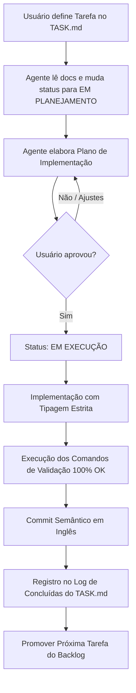

# Template Core/Greenfield de Desenvolvimento Orientado a Agentes (ADD)

🌐 **[English](README.md) | Português**

Este repositório é o starter kit canônico (**Core / Greenfield**) projetado para potencializar o desenvolvimento de software colaborativo do zero com **agentes de Inteligência Artificial** (ex: Antigravity, Claude Code, Cursor, Windsurf, Roo Code, Aider, etc.).

A estrutura foi desenhada para resolver os maiores problemas no uso de agentes em projetos reais: **perda de contexto**, **alucinações em tarefas longas**, **violação de padrões de código** e **retrabalho**.

---

## 📁 Estrutura do Template

```text
├── AGENTS.md                 # A "Constituição" do projeto (regras inegociáveis, stack, MCPs e comandos)
├── .agent/
│   ├── TASK.md               # Tarefa ativa, critérios de aceite e roadmap imediato
│   ├── NOTES.md              # Decisões arquiteturais rápidas, contratos de dados e armadilhas
│   ├── ARCHIVE.md            # Histórico de tarefas antigas (preserva contexto enxuto)
│   ├── ECOSYSTEM.md          # Topologia multi-repo, contratos entre serviços e raio de impacto (opcional)
│   ├── adr/                  # Registros de Decisões Arquiteturais complexas (ADRs formais)
│   │   └── 000-template.md   # Template padrão de ADR
│   └── skills/               # Habilidades procedurais especializadas do projeto
│       ├── README.md         # Guia de quando e como criar skills
│       └── 000-template.md   # Template padrão de SKILL.md
├── .env.example              # Exemplo de variáveis de ambiente do projeto
├── .gitignore                # Padrão amplo (Node, Python, Docker, caches de agentes)
└── README.md                 # Este guia (para desenvolvedores humanos)
```

---

## 🚀 Como Iniciar um Novo Projeto com este Template

### Opção 1: Via Inicializador Automático One-Liner (Recomendado)

Crie um novo projeto instantaneamente a partir do seu terminal:

```bash
curl -fsSL https://raw.githubusercontent.com/ye-sandbox/template-agent/greenfield/init.sh | bash -s -- meu-novo-projeto
```

O script clonará a branch `greenfield` e inicializará automaticamente um repositório Git novo e limpo, pronto para uso.

---

### Opção 2: Clone Manual do Git

```bash
git clone --depth 1 -b greenfield https://github.com/ye-sandbox/template-agent.git meu-novo-projeto
cd meu-novo-projeto
rm -rf .git && git init -b main
git add . && git commit -m "chore: initial template setup"
```

### Passo 2: Configurar o `AGENTS.md`
Abra o arquivo [`AGENTS.md`](./AGENTS.md) e substitua todos os campos entre `[COLCHETES]`:
1. Nome do projeto e resumo da arquitetura.
2. Sistema operacional e **Shell padrão** do ambiente (ex: PowerShell ou Bash).
3. Stack tecnológico de cada serviço/módulo (linguagens, versões e gerenciadores de pacote).
4. Servidores MCP autorizados e Habilidades (Skills) do projeto.
5. Comandos exatos de validação (`testes`, `linter`, `checagem de tipos`, `build`).
6. Apague as seções que não se aplicarem (ex: seção Docker se o projeto não utilizar contêineres).
7. Remova a seção `Checklist Rápido de Adaptação` ao terminar.

### Passo 3: Configurar Variáveis de Ambiente e MCPs
Copie o arquivo de exemplo e ajuste os valores necessários para seu ambiente local:
```bash
cp .env.example .env
```
Se o projeto utilizar servidores MCP (ex: banco de dados local, APIs, observabilidade), configure-os no arquivo de configuração do seu agente/IDE (`antigravity`, `claude_desktop`, etc.).

### Passo 4: Definir a Primeira Tarefa no `.agent/TASK.md`
Abra [`.agent/TASK.md`](./.agent/TASK.md):
1. Preencha a seção **📌 Tarefa Ativa** com o primeiro objetivo real (ex: `Setup do esqueleto da API`).
2. Defina **Critérios de Aceite** claros e mensuráveis.
3. Marque o status inicial como `PRONTO PARA PLANEJAMENTO`.

### Passo 5: Iniciar o Trabalho com o Agente de IA
No prompt da sua ferramenta de IA favorita, instrua o agente:
> *"Leia o AGENTS.md, .agent/TASK.md, .agent/NOTES.md e as skills em .agent/skills/. Apresente seu plano de implementação para a Tarefa Ativa do TASK.md antes de alterar qualquer código."*

---

## 🔄 Fluxo de Trabalho (Ciclo de Vida de uma Tarefa)



---

## 💡 Melhores Práticas para Trabalhar com Agentes

1. **Uma coisa por vez:** Mantenha cada tarefa atômica. Se um pedido crescer, quebre em sub-tarefas no `TASK.md`.
2. **Confie no DoD (Definition of Done):** Não aceite tarefas com testes ou linter pendentes.
3. **Mantenha os arquivos enxutos:**
   - O `TASK.md` deve conter apenas a tarefa atual e títulos das próximas.
   - O `NOTES.md` guarda decisões e contratos que **não são óbvios olhando o diff do Git**.
   - Detalhes profundos de implementação pertencem às mensagens de commit e ao histórico do Git.
